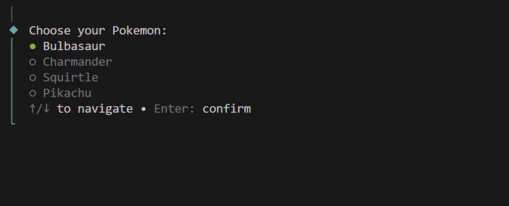

# Terminal Battle

A terminal battle game written in TypeScript, emulating the Pokemon franchise's battle system. Pick two Pokemon and fight turn by turn, with stats, natures, type effectiveness, and move priority modeled after the main series.



## Features
- Choose your Pokemon and your opponent's
- Stats calculated from base stats, IVs, EVs, nature, and level
- Type effectiveness and STAB damage
- Turn order by move priority, then speed
- Colored HP bars and battle log

## Tech
TypeScript, Node.js, [chalk](https://github.com/chalk/chalk), [@clack/prompts](https://github.com/bombshell-dev/clack)

## Getting Started

**Requirements:** Node.js 18+

```bash
git clone https://github.com/ryagor/terminal-battle.git
cd terminal-battle
npm install
npm run build
npm start
```

## Project Structure
```
src/
├── data/    # Pokedex, moves, stats, natures, type chart
├── game/    # Pokemon and Battle logic
├── ui/      # Menus (prompts) and Renderer (output)
├── utils/   # Utilities for formatting output
└── index.ts # Entry point
```

## How It Works
1. Choose a Pokemon for each side.
2. Each turn, pick a move. The opponent picks randomly.
3. Moves resolve by priority, then speed.
4. The battle ends when a Pokemon faints.

## Unimplemented Features (To-Do List)
- Status effects
- Abilities
- Accuracy and critical hits
- Items
